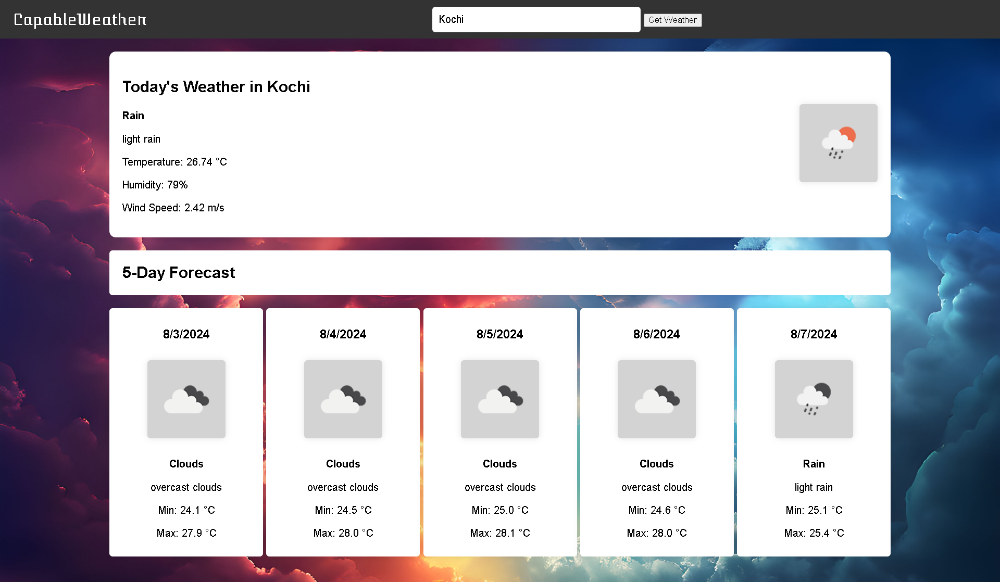

# CapablWeather

A simple 5-day weather forecast website using OpenWeatherMap API.

## Features
--------

* 5-day weather forecast
* Current day weather details (temperature, humidity, wind speed)
* Weather icons for each day
* Responsive design

## Getting Started
---------------

1. Clone the repository: `git clone https://github.com/VaishnavKrishnanP/CapablWeather.git`
2. Replace `your_api_key_here` with your actual OpenWeatherMap API key in `app.js`
3. Open `index.html` in a web browser

## API Documentation
-----------------

This project uses the OpenWeatherMap API. You can find the API documentation [here](https://openweathermap.org/api).

## License
-------

This project is licensed under the GNU General Public License v3.0. See `LICENSE` for details.

### Screenshots

### Credits

* OpenWeatherMap API for providing the weather data
* Font Awesome for the weather icons
* Playground.ai for generating the `img.jpeg` background image
